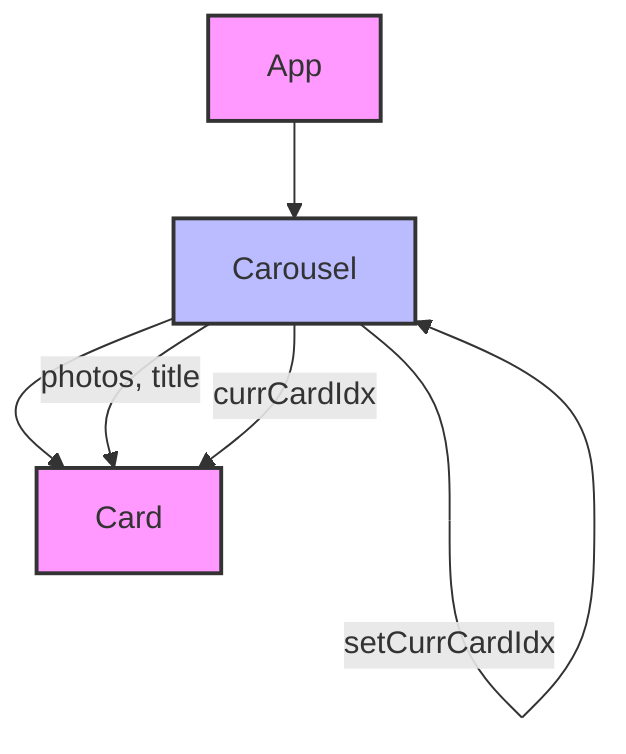
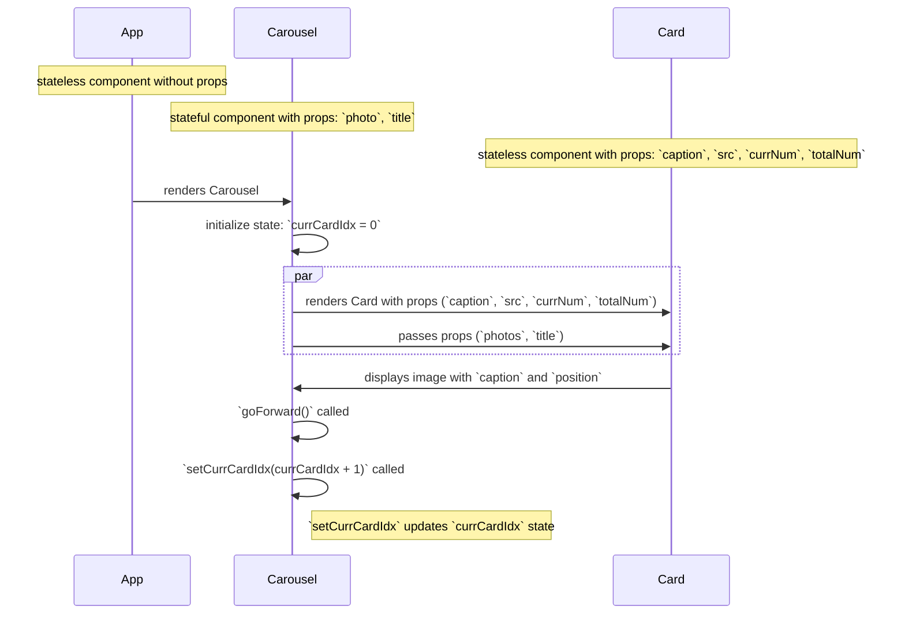

This project was bootstrapped with [Create React App](https://github.com/facebook/create-react-app).

## my notes

### errors that occur with starting codebase

**1. Cannot read properties of undefined (reading 'caption')**

After downloading the starting codebase for this exercise I installed the dependencies and ran `npm start`. Immediately afterward I received the error below which repeated over and over again.

```
ERROR
Cannot read properties of undefined (reading 'caption')
TypeError: Cannot read properties of undefined (reading 'caption')
    at Carousel (http://localhost:3000/static/js/bundle.js:273:27)
    at renderWithHooks (http://localhost:3000/static/js/bundle.js:19677:22)
    at updateFunctionComponent (http://localhost:3000/static/js/bundle.js:23244:24)
    at beginWork (http://localhost:3000/static/js/bundle.js:24963:20)
    at HTMLUnknownElement.callCallback (http://localhost:3000/static/js/bundle.js:9933:18)
    at Object.invokeGuardedCallbackDev (http://localhost:3000/static/js/bundle.js:9977:20)
    at invokeGuardedCallback (http://localhost:3000/static/js/bundle.js:10034:35)
    at beginWork$1 (http://localhost:3000/static/js/bundle.js:29932:11)
    at performUnitOfWork (http://localhost:3000/static/js/bundle.js:29180:16)
    at workLoopSync (http://localhost:3000/static/js/bundle.js:29103:9)
```

I believe the error `Cannot read properties of undefined (reading 'caption')` indicates that the `currCard` variable in the `Carousel` component is `undefined` at the time you are trying to access its `caption` property. I believe this can happen if the `photos` array passed to the `Carousel` component is empty or if `currCardIdx` is out of bounds. In an attempt to fix this, I added a check to ensure `currCard` is defined before trying to access its properties by modifying the `Carousel` component from this:

#### pre-refactor

```
import { useState } from "react";
import "./Carousel.css";
import Card from "./Card";

 function Carousel({ photos, title }) {
  const [currCardIdx, setCurrCardIdx] = useState(0);

  const currCard = photos[currCardIdx];
  const total = photos.length;

  //Increments currCardIdx state by 1
  function goForward() {
    setCurrCardIdx(currCardIdx + 1);
  }

  return (
    <div className="Carousel">
      <h1>{title}</h1>
      <div className="Carousel-main">
        <i
          className="bi bi-arrow-left-circle"
          onClick={goForward}
        />
        <Card
          caption={currCard.caption}
          src={currCard.src}
          currNum={currCardIdx + 1}
          totalNum={total}
        />
        <i
          className="bi bi-arrow-right-circle"
          onClick={goForward}
        />
      </div>
    </div>
  );
}

export default Carousel;
```

to this:

#### post-refactor

```
import { useState } from "react";
import "./Carousel.css";
import Card from "./Card";

/** Carousel: displays images and arrows to navigate through them
 *
 * Props:
 * - photos: array of {src, caption} objects
 * - title: string describing the collection of images
 *
 * State:
 * - currCardIdx: integer for current card index
 *
 * App --> Carousel --> Card
 */
function Carousel({ photos, title }) {
  const [currCardIdx, setCurrCardIdx] = useState(0);

  const currCard = photos[currCardIdx];
  const total = photos.length;

  // Increments currCardIdx state by 1
  function goForward() {
    setCurrCardIdx((currCardIdx + 1) % total); //<--NEW CODE ADDED
  }

  return (
    <div className="Carousel">
      <h1>{title}</h1>
      <div className="Carousel-main">
        <i
          className="bi bi-arrow-left-circle"
          onClick={goForward}
        />
        {currCard && (   //<--NEW CODE ADDED
          <Card
            caption={currCard.caption}
            src={currCard.src}
            currNum={currCardIdx + 1}
            totalNum={total}
          />
        )}
        <i
          className="bi bi-arrow-right-circle"
          onClick={goForward}
        />
      </div>
    </div>
  );
}

export default Carousel;
```

This code ensures that the Card component is only rendered if currCard is defined. Additionally, the goForward function is updated to wrap around when it reaches the end of the photos array.

**2. Uncaught runtime errors:**

I have experienced this error on each React JS project that I've worked on in this unit and I cannot figure out what is causing it. I've listed my notes below in case I can go over it with a mentor or on Slack.

#### error message

```
Uncaught runtime errors:
×
ERROR
Unexpected token '<'
SyntaxError: Unexpected token '<'
ERROR
Unexpected token '<'
SyntaxError: Unexpected token '<'
```

#### console screenshot with errors


#### network screenshot with errors


**3. Part 4: Bug! Exhausting the image array**

I did not experience the error below based on the starting code and refactors.  Instead of causing an error when I click past the array it starts over at the first element in the array.

"As you may have noticed, if you’re on the last image and try to move forward, or if you’re on the first image and try to move backward, you get an error. To fix this, let’s just hide the left arrow on the first image and the right arrow on the last.

Write a (failing) test to check that the left arrow is missing when you’re on the first image, and that the right arrow is missing when you’re on the last image. Then fix the bug so that your test turns green."


## component hierarchy

### Interpreting the Component Hierarchy Diagram

The diagram represents the component hierarchy of my React application, highlighting which components have state and how state changes occur. Here's a detailed summary:

### Components Overview

**1. App:**

- **Type:** Stateless component.
- **Description:** The root component of the application. It renders the `Carousel` component.
- **Props:** None.
- **State:** None.

**2. Carousel:**

- **Type:** Stateful component.
- **Description:** Displays a collection of images with navigation arrows to move through them.
- **Props:**
  - **`photos`:** An array of objects containing `src` and `caption` for each image.
  - **`title`:** A string describing the collection of images.
- **State:**
  - **`currCardIdx`:** An integer representing the current card index.
- **State Change:**
  - **`setCurrCardIdx`:** Updates the `currCardIdx` state. This is done via the `goForward` function, which increments the currCardIdx by 1.

**3. Card:**

- **Type:** Stateless component.
- **Description:** Displays an individual image with its caption and position in the collection.
- **Props:**
  - **`caption`:** A string describing the image.
  - **`src`:** A string for the image link.
  - **`currNum`:** An integer representing the current image number.
  - **`totalNum`:** An integer representing the total number of images in the collection.
- **State:** None.

### Diagram Annotations

**1. Component Types:**

- Stateless Components: Represented with a pink fill (#f9f).
- Stateful Components: Represented with a blue fill (#bbf).

**2. State and Props Flow:**

- The arrows (-->) indicate the parent-child relationship between components.
- The labels on the arrows (e.g., photos, title, currCardIdx) indicate the props being passed from the parent to the child component.
- The self-referencing arrow on Carousel (B -->|setCurrCardIdx| B) indicates that the Carousel component manages its own state using the setCurrCardIdx function.

**3. Clickable Links:**

- The click annotations make the Carousel and Card components clickable, linking to their respective source files (Carousel.js and Card.js) for easy navigation.
- This diagram and summary provide a clear understanding of the structure and state management within my React application.



---



## Available Scripts

In the project directory, you can run:

### `npm start`

Runs the app in the development mode.<br />
Open [http://localhost:3000](http://localhost:3000) to view it in the browser.

The page will reload if you make edits.<br />
You will also see any lint errors in the console.

### `npm test`

Launches the test runner in the interactive watch mode.<br />
See the section about [running tests](https://facebook.github.io/create-react-app/docs/running-tests) for more information.

### `npm run build`

Builds the app for production to the `build` folder.<br />
It correctly bundles React in production mode and optimizes the build for the best performance.

The build is minified and the filenames include the hashes.<br />
Your app is ready to be deployed!

See the section about [deployment](https://facebook.github.io/create-react-app/docs/deployment) for more information.

### `npm run eject`

**Note: this is a one-way operation. Once you `eject`, you can’t go back!**

If you aren’t satisfied with the build tool and configuration choices, you can `eject` at any time. This command will remove the single build dependency from your project.

Instead, it will copy all the configuration files and the transitive dependencies (webpack, Babel, ESLint, etc) right into your project so you have full control over them. All of the commands except `eject` will still work, but they will point to the copied scripts so you can tweak them. At this point you’re on your own.

You don’t have to ever use `eject`. The curated feature set is suitable for small and middle deployments, and you shouldn’t feel obligated to use this feature. However we understand that this tool wouldn’t be useful if you couldn’t customize it when you are ready for it.

## Learn More

You can learn more in the [Create React App documentation](https://facebook.github.io/create-react-app/docs/getting-started).

To learn React, check out the [React documentation](https://reactjs.org/).

### Code Splitting

This section has moved here: https://facebook.github.io/create-react-app/docs/code-splitting

### Analyzing the Bundle Size

This section has moved here: https://facebook.github.io/create-react-app/docs/analyzing-the-bundle-size

### Making a Progressive Web App

This section has moved here: https://facebook.github.io/create-react-app/docs/making-a-progressive-web-app

### Advanced Configuration

This section has moved here: https://facebook.github.io/create-react-app/docs/advanced-configuration

### Deployment

This section has moved here: https://facebook.github.io/create-react-app/docs/deployment

### `npm run build` fails to minify

This section has moved here: https://facebook.github.io/create-react-app/docs/troubleshooting#npm-run-build-fails-to-minify
